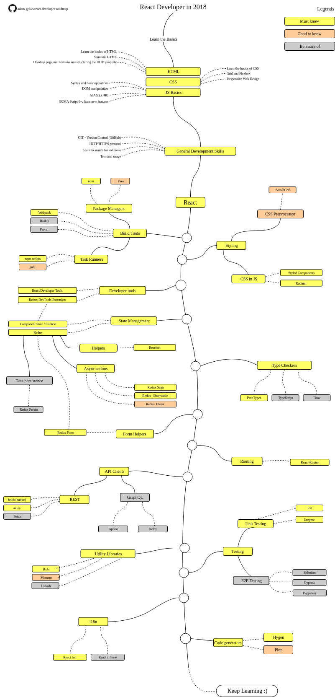

# Serenova React Developer Roadmap

> Roadmap to becoming a React developer in 2018

Below you can find a chart demonstrating the paths that you can take and the libraries that you would want to learn in order to become a React developer. This chart was made for as a tip for everyone who asks "What should I learn next as a React developer?"

The purpose of this roadmap is to give you an idea about the landscape. The road map will guide you if you are confused about what to learn next.

## Roadmap

## Resources

1. Basics
    1. HTML
        * Learn the basics of HTML
        * [Course](https://www.codecademy.com/learn/learn-html)
    2. CSS
        * Learn the basics of CSS
        * [Course](https://www.codecademy.com/learn/learn-css)
        * Build a page with grid and flexbox
    3. JS Basics
        * Get familiar with the basics
        * [Course](https://www.codecademy.com/learn/introduction-to-javascript)
        * Learn new features (ECMA Script 6+)
2. General Development Skills
    1. GIT 
        * [Course](https://www.codecademy.com/learn/learn-git)
        * Fork a few repositories on GitHub, share your code with other people
    2. Know HTTP(S) protocol, request methods (GET, POST, PUT, PATCH, DELETE, OPTIONS)
    3. Don't be afraid of using Google, [Power Searching with Google](http://www.powersearchingwithgoogle.com/)
    4. Get familiar with terminal, configure your shell (bash)
3. Learn React on [official website](https://reactjs.org/tutorial/tutorial.html) or complete some [courses](https://egghead.io/courses/the-beginner-s-guide-to-react)
4. Get familiar with tools that you will be using
    1. Package Managers
        * [npm](https://www.npmjs.com/)
        * [yarn](https://yarnpkg.com/lang/en/)
    2. Task Runners
        * [npm scripts](https://docs.npmjs.com/misc/scripts)
        * [gulp](https://gulpjs.com/)
    * [Webpack](https://webpack.js.org/)
    * [Rollup](https://rollupjs.org/guide/en)
    * [Parcel](https://parceljs.org/)
5. Styling
    1. CSS in JS
        * [Styled Components](https://www.styled-components.com/)
        * [Radium](https://formidable.com/open-source/radium/)
    2. CSS Preprocessor
        * [Sass/CSS](https://sass-lang.com/)
6. State Management
    1. [Component State](https://reactjs.org/docs/faq-state.html)/[Context API](https://reactjs.org/docs/context.html)
    2. [Redux](https://redux.js.org/)
        1. Async actions (Side Effects)
            * [Redux Saga](https://redux-saga.js.org/)
            * [Redux Observable](https://redux-observable.js.org)
            * [Redux Thunk](https://github.com/reduxjs/redux-thunk)
        2. Data persistence
            * [Redux Persist](https://github.com/rt2zz/redux-persist)
        3. [Redux Form](https://redux-form.com)
7. Type Checkers
    * [PropTypes](https://reactjs.org/docs/typechecking-with-proptypes.html)
    * [TypeScript](https://www.typescriptlang.org/)
    * [Flow](https://flow.org/en/)
8. Form Helpers
    * [Redux Form](https://redux-form.com)
9. Routing
    * [React-Router](https://reacttraining.com/react-router/)
10. API Clients
    1. REST
        * [Fetch](https://developer.mozilla.org/en-US/docs/Web/API/Fetch_API)
        * [axios](https://github.com/axios/axios)
    2. GraphQL
        * [Apollo](https://www.apollographql.com/docs/react/)
        * [Relay](https://facebook.github.io/relay/)
11. Utility Libraries
    * [RxJS](http://reactivex.io/)
    * [Moment](https://momentjs.com/)
    * [Lodash](https://lodash.com/)
12. Testing
    1. Unit Testing
        * [Jest](https://facebook.github.io/jest/)
        * [Enzyme](http://airbnb.io/enzyme/)
    2. End to End Testing
        * [Selenium](https://www.seleniumhq.org/), [Webdriver](http://webdriver.io/)
        * [Cypress](https://cypress.io/)
        * [Puppeteer](https://pptr.dev/)
13. Internationalization
    * [React Intl](https://github.com/yahoo/react-intl)
    * [React i18next](https://react.i18next.com/)
14. Code generators
    * [Hygen](https://www.hygen.io/)
    * [Plop](https://plopjs.com/)

## Contribution

The roadmap is built using [Draw.io](https://www.draw.io/). Project file can be found at `/src` directory. To modify it, open draw.io, click **Open Existing Diagram** and choose `xml` file with project. It will open the roadmap for you, update it, upload and update the images in readme and create a PR (export as png).

- Open pull request with improvements
- Discuss ideas in issues

## License

